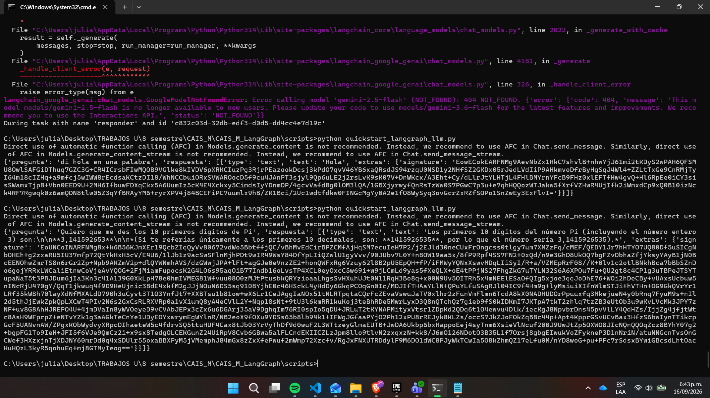
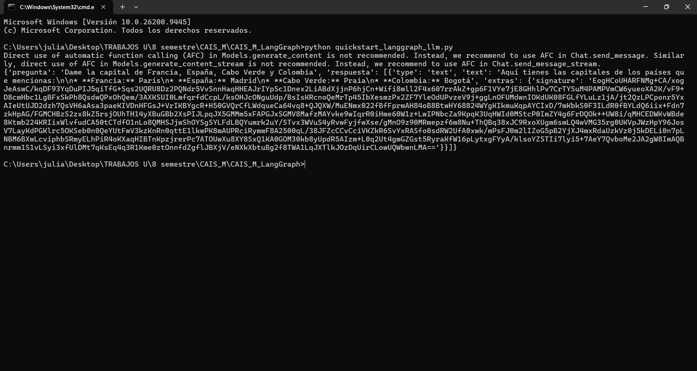
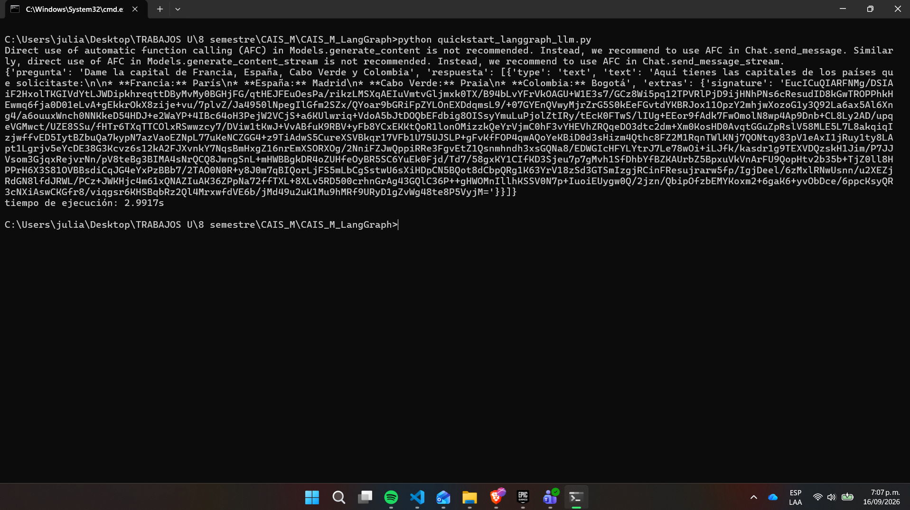

# CAIS_M LangGraph

Ejemplos de construcción y ejecución de grafos con [LangGraph](https://langchain-ai.github.io/langgraph/) en Python. El proyecto incluye un grafo local y otro conectado a Google Gemini mediante LangChain.

## Estructura del proyecto

```text
CAIS_M_LangGraph/
├── .env                    # configuración local; ignorado por Git
├── .env.example            # plantilla de configuración
├── .gitignore
├── README.md
├── requirements.txt
├── quickstart_langgraph.py
├── quickstart_langgraph_llm.py
└── docs/
    └── img/
        └── evidencia.png
```

### Archivos

- `quickstart_langgraph.py`: grafo local con los nodos `analizar` y `responder`. Mantiene la pregunta, la respuesta y el número de pasos.
- `quickstart_langgraph_llm.py`: grafo de un nodo que envía una pregunta a Google Gemini usando `ChatGoogleGenerativeAI`.
- `requirements.txt`: dependencias fijadas del proyecto.
- `.env.example`: plantilla para la clave de Google.
- `.gitignore`: excluye archivos `.env` y carpetas de entornos virtuales.
- `docs/img/evidencia.png`: captura de evidencia de ejecución.

## Requisitos

- Python 3.10 o superior.
- Una clave de API de Google Gemini para ejecutar el ejemplo con Gemini.

## Instalación

### Opción A: sin entorno virtual (así se hizo en esta prueba)

**Windows:**
```powershell
python -m pip install --upgrade pip
pip install langgraph langchain-google-genai python-dotenv
pip freeze > requirements.txt
```

**macOS / Linux:**
```bash
python3 -m pip install --upgrade pip
pip3 install langgraph langchain-google-genai python-dotenv
pip3 freeze > requirements.txt
```

> **Nota:** en esta prueba las dependencias se instalaron sin entorno virtual,
> por lo que el `requirements.txt` incluido puede contener paquetes
> adicionales ya presentes en el sistema.

### Opción B: con entorno virtual (recomendado para un entorno limpio)

**Windows:**
```powershell
python -m venv .venv
.\.venv\Scripts\Activate.ps1
python -m pip install --upgrade pip
pip install langgraph langchain-google-genai python-dotenv
pip freeze > requirements.txt
```
> Si `Activate.ps1` da error de permisos, corre primero:
> ```powershell
> Set-ExecutionPolicy -Scope Process -ExecutionPolicy RemoteSigned
> ```

**macOS / Linux:**
```bash
python3 -m venv .venv
source .venv/bin/activate
python3 -m pip install --upgrade pip
pip3 install langgraph langchain-google-genai python-dotenv
pip3 freeze > requirements.txt
```

Para desactivar el entorno virtual en cualquier sistema:
```bash
deactivate
```

Para recrear el entorno más adelante a partir de `requirements.txt`:
```bash
pip install -r requirements.txt
```

## Configuración

Copia `.env.example` como `.env` y agrega tu clave:

```powershell
Copy-Item .env.example .env
```

Después edita `.env`:

```env
GOOGLE_API_KEY=tu_clave_de_google
```

`.env` está excluido por `.gitignore`; no subas claves de API al repositorio.

## Ejecución

### Grafo local

```powershell
python quickstart_langgraph.py
```

Construye y compila el flujo:

```text
analizar -> responder -> fin
```

El grafo procesa la pregunta `¿qué es LangGraph?`, muestra el estado final y calcula el tiempo de ejecución.

### Grafo con Gemini

Con `GOOGLE_API_KEY` configurada, ejecuta:

```powershell
python quickstart_langgraph_llm.py
```

El script carga la variable desde `.env`, usa el modelo `gemini-3.6-flash` y solicita los diez primeros dígitos de Pi.

## Conceptos de LangGraph

- `TypedDict`: define la forma del estado que circula por el grafo.
- `StateGraph`: crea el grafo cuyos nodos reciben y devuelven el estado.
- `add_node`: registra funciones como nodos.
- `set_entry_point`: establece el nodo inicial.
- `add_edge`: conecta los nodos.
- `compile`: prepara el grafo para ejecutarlo.
- `invoke`: ejecuta el grafo con un estado inicial.

## Evidencia




## Evidencia con Tiempo de Llamado de Grafo al LLM




## Autor

- [Julian Camilo Lopez Barrero](https://github.com/JulianLopez11)